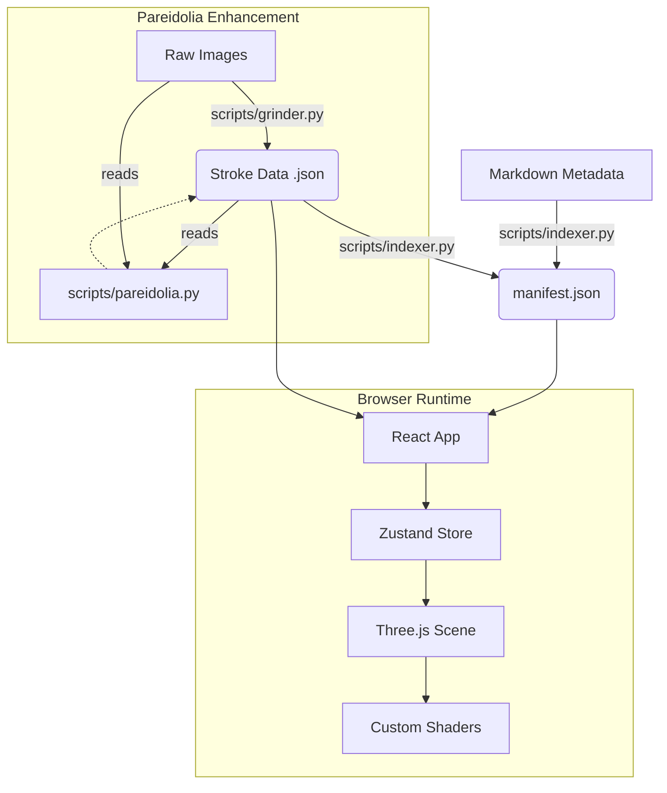

# Architecture Overview

The "Infinite Void" is designed as a hybrid static-dynamic site. The heavy lifting of 3D data generation is done offline (Pre-processing), allowing the runtime (Browser) to load lightweight JSON data and render it performantly.

## System Diagram

## Core Concepts

### 1. The "Stroke Cloud" (Data Structure)
Instead of displaying a flat textured quad, every image is decomposed into thousands of individual "strokes".
- **Grinder**: Uses AI (MiDaS + Segment Anything) to analyze an image and break it into segments.
- **Data**: Each stroke has a Position (X,Y), Depth (Z), Color, Scale, and Entropy (Randomness).
- **Format**: JSON arrays. Optimized for fast parsing and upload to GPU buffers.

### 2. Anamorphic Projection (Visual Theory)
The strokes are placed in a volumetric 3D space.
- **Sweet Spot**: There is only ONE specific coordinate in the 3D world (Camera Z position) where the strokes align perfectly to form the original image.
- **Chaos**: As the camera moves away from this sweet spot, the strokes are displaced mathematically (in the Vertex Shader) to create an "exploding" or "drifting" effect.
- **Pareidolia**: Specific strokes are tagged as "faces". These react differently to the chaos, lingering longer or staring back at the user.

### 3. State Management (Zustand)
The application state is managed by a centralized Zustand store (`useStore.js`).
- **Graph Traversal**: The store holds the "Nearest Neighbor" graph generated by the Indexer.
- **Pathfinding**: When a user leaves an artwork, the store calculates the `nextId` based on color similarity and history (avoiding loops).
- **Transition Progress**: A normalized float (0.0 to 1.0) that represents the user's journey between the `activeId` (Start) and `nextId` (End).

### 4. The Rendering Loop (React Three Fiber)
The application does not use standard HTML scrolling.
1.  **Input**: User scrolls mouse wheel.
2.  **CameraRig**: Captures scroll delta, applies physics (momentum/friction), and updates `transitionProgress`.
3.  **InfiniteCanvas**:
    -   Reads `transitionProgress`.
    -   Passes a `uChaos` uniform to the GPU.
    -   The Shader creates the explosion effect based on `uChaos`.
4.  **Scene Management**:
    -   When `transitionProgress` > 1.0: The `nextId` becomes the `activeId`. A new `nextId` is pre-fetched.
    -   When `transitionProgress` < 0.0: The user moves backwards in history.

### 5. Custom Shaders (`AnamorphicShader.js`)
We bypass standard Three.js materials for performance and artistic control.
-   **Vertex Shader**: Handles the position logic. Moves pixels based on Depth and Chaos.
-   **Fragment Shader**: Handles color mixing and fading.
-   **InstancedBufferGeometry**: We use a single geometry instance for thousands of strokes, updating only the attribute buffers (Color, Position) when the artwork changes. This keeps Draw Calls to a minimum (1 draw call per artwork).
