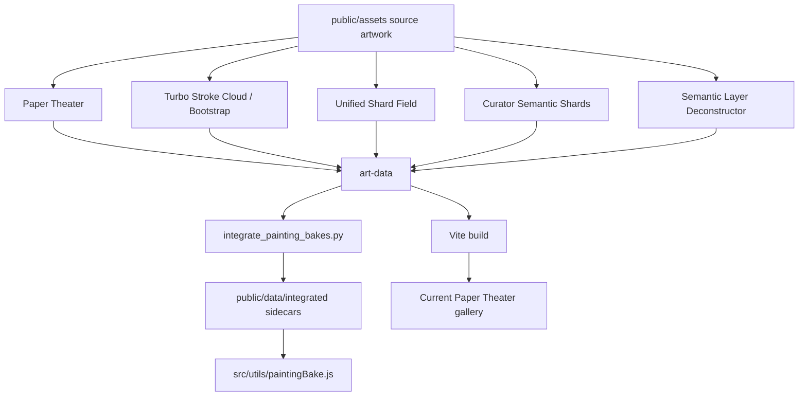

# Architecture Overview

The project is a Vite + React + react-three-fiber gallery with **multiple intentional offline art-processing pipelines**. The shipped visual renderer currently uses the Paper Theater representation, but stroke-cloud, unified-shard, semantic-shard, semantic-layer, and flat-image representations remain first-class capabilities. A canonical integration layer indexes whatever representations exist for each painting without replacing their native files.

For the creative brief see [`../AGENTS.md`](../AGENTS.md). For pipeline details see [`PIPELINE.md`](./PIPELINE.md); for the cross-pipeline contract see [`INTEGRATION.md`](./INTEGRATION.md).

## System map


```mermaid
graph TD
    A[public/assets source artwork]
    A --> TB[Paper Theater]
    A --> SC[Turbo Stroke Cloud / Bootstrap]
    A --> US[Unified Shard Field]
    A --> CU[Curator Semantic Shards]
    A --> SL[Semantic Layer Deconstructor]

    TB --> AD[art-data]
    SC --> AD
    US --> AD
    CU --> AD
    SL --> AD

    AD --> INTEGRATE[integrate_painting_bakes.py]
    INTEGRATE --> SIDE[public/data/integrated sidecars]
    SIDE --> LOADER[src/utils/paintingBake.js]

    AD --> BUILD[Vite build]
    BUILD --> GALLERY[Current Paper Theater gallery]
```

The diagram describes capability ownership, not a requirement that every producer run on every deploy. Native pipeline outputs remain authoritative; integration only discovers and indexes them.

## Current production renderer

The current browser renderer is Paper Theater. `scripts/theater_baker.py` produces `{id}.painting.webp`, `{id}.depth.png`, and `{id}.theater.json`. `scripts/pareidolia_index.py` builds `graph.theater.json`. `scripts/validate_output.py` gates publication. The runtime `TheaterPainting.jsx` reconstructs paintings from depth-band cutout planes with mirrored layers, parallax, hinge reveals, chroma/paper mattes, and background sweep behavior.

`src/store/useStore.jsx` walks the theater hinge graph and places paintings in world space. `AnamorphicCam.jsx` drives the scroll/camera path. This is the representation relied on by the shipped site today; it is not the only intended representation in the repository.

## Intentional parallel representations

### Turbo Stroke Cloud

`process_art.yml` runs `scripts/grinder.py` in parallel and publishes compact SAM/color/depth stroke records to `art-data`. `bootstrap.yml` provides a five-image manual path through `scripts/bootstrap.py`. Both compact `s` and older `strokes` forms are retained and can coexist for the same painting.

### Unified Shard Field

`scripts/prepare.py` orchestrates `scripts/shard_prep/segmentation.py`, `depth.py`, `projection.py`, and `graph_builder.py`. It produces painterly SLIC/LAB shards, anamorphic/mirrored geometry, and a DINOv2 graph. The `shard_prep` package is a dependency package of this entry point, not an orphan.

### Perspective Shard Bake

`scripts/bake-shards.js` converts existing stroke/shard records into GPU-oriented perspective-corrected baked arrays under `public/data/baked/`.

### Curator Semantic Shard Cloud

`scripts/curator.py` combines SAM, depth, and DINOv2 embeddings. It writes semantic shard JSON plus `_pos.bin`, `_uv.bin`, and `_scale.bin` buffers and contributes semantic graph edges.

### Semantic Layer Deconstructor

`scripts/3d_deconstructor.py` produces a smaller number of larger depth-aware semantic slices. This representation sits between flat depth bands and dense shard clouds.

### Flat Image Fallback

`public/graph.json` plus `public/assets/` remains a valid low-complexity representation/fallback. `scripts/verify-assets.cjs` repairs that graph in the ephemeral deploy checkout.

## Canonical integration boundary

`scripts/integrate_painting_bakes.py` runs after `art-data` is checked out during deployment. It writes:

```text
public/data/integrated/_manifest.json
public/data/integrated/{id}.painting-bake.json
```

The schema is [`../schemas/painting-bake.schema.json`](../schemas/painting-bake.schema.json). Recognized representation families are:

- `theater`
- `strokeCloud`
- `unifiedShardField`
- `perspectiveShardBake`
- `semanticShardCloud`
- `semanticLayers`
- `flatImage`

When several native artifacts from one family map to the same painting, integration stores them as `variants`; it never silently chooses a winner. Transition graphs are also kept distinct (`theater` vs `legacyOrUnified`) so different algorithms are not collapsed into a fake common score.

`src/utils/paintingBake.js` is the runtime discovery API. It loads the integrated manifest and records, expands variants, reports available representations, and exposes transition edges. Existing theater rendering remains unchanged until a renderer explicitly chooses to consume another representation.

## CI/CD topology

The art workflows publish native data to the orphan `art-data` branch using `keep_files: true` so one representation does not erase the others. The main relevant paths are:

- `theater_bake.yml` — Paper Theater bake + hinge graph + validation.
- `process_art.yml` — Turbo stroke-cloud producer.
- `bootstrap.yml` — manual five-image stroke/bootstrap producer.
- `remove_painting.yml` — removal path for published art.
- `deploy.yml` — checks out `art-data`, tests the integration builder, regenerates integrated sidecars, verifies legacy assets, builds Vite, and deploys GitHub Pages.
- `deploy-sftp.yml` — self-hosted mirror deploy.

Central workflow proxies dispatch through `HereLiesAz/workflows`; local proxy files should not be treated as the implementation body of those workflows.

## State and rendering invariants

The current renderer keeps important constraints documented in the component/source comments:

- painting null positions are axis-aligned so depth-band layers fully coalesce;
- depth-band boundaries use hard discard rather than alpha blending;
- `useStore.jsx` updates segment index/progress atomically per frame;
- viewport-dependent placement is recomputed after resize/rotation;
- reduced-motion changes camera/reveal behavior without changing data contracts;
- `bgSweep` aggregates light-background paintings by mounted instance, not painting id.

These production constraints should be preserved when adding alternate representation consumers.

## Script status policy

Do **not** infer product intent from absence of a current caller. Use precise implementation status:

- **production** — relied on by the shipped site;
- **wired** — reachable from a workflow/runtime path;
- **unwired** — implementation exists but currently lacks an execution or consumer path;
- **incomplete** — intended behavior is only partially implemented;
- **broken** — a known defect prevents intended execution;
- **overlapping** — another pipeline addresses part of the same problem differently;
- **experimental** — intentionally exploratory.

The following retained tools are intentional unless Az explicitly retires them: `grinder.py`, `bootstrap.py`, `indexer.py`, `pareidolia.py`, `curator.py`, `jules.py`, `3d_deconstructor.py`, `prepare.py`, `repair_and_index.py`, `bake-shards.js`, and `scripts/shard_prep/` with its tests.

Removal requires an explicit product decision, not a grep result.
