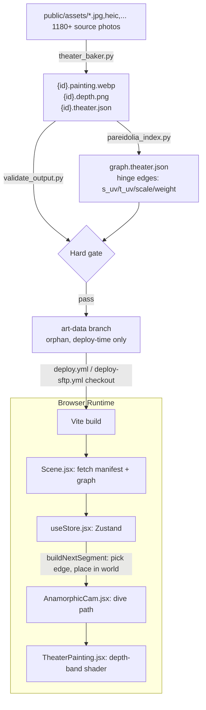
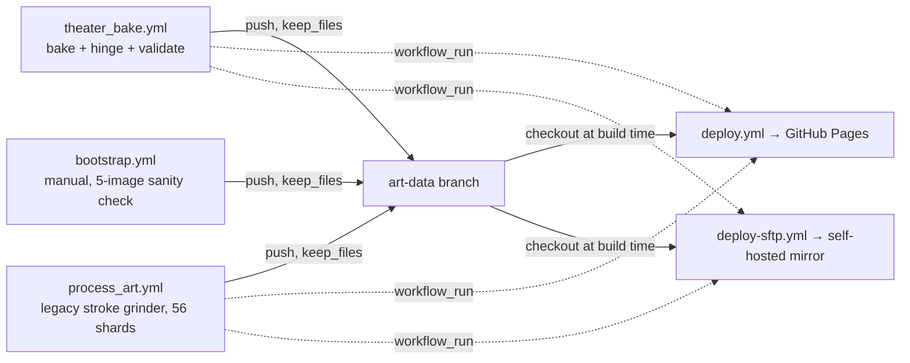

# Architecture Overview

The site is a hybrid static/dynamic build: a Python pipeline bakes every
painting offline into a tiny per-painting data model (a photo-realistic
crop, its depth map, and some band metadata) plus a graph of shared
"hinge" patches between paintings. The browser fetches that baked data at
runtime and reassembles each painting from flat depth-band cutouts, using
the hinge graph to decide which painting to dive into next and where, in
world space, the shared patch between two paintings should land.

For the creative brief this implements, see [`../AGENTS.md`](../AGENTS.md).
For the exact visual/sensory rules, see [`AESTHETIC.md`](./AESTHETIC.md).
For day-to-day "how do I add art" instructions, see
[`WORKFLOW.md`](./WORKFLOW.md). This document is the system-level map.

## System diagram

```mermaid
graph TD
    A[public/assets/*.jpg,heic,... 1180+ source photos] -->|theater_baker.py| B["{id}.painting.webp<br/>{id}.depth.png<br/>{id}.theater.json"]
    B -->|pareidolia_index.py| C[graph.theater.json<br/>hinge edges: s_uv/t_uv/scale/weight]
    B -->|validate_output.py| G{Hard gate}
    C --> G
    G -->|pass| D[art-data branch<br/>orphan, deploy-time only]
    D -->|deploy.yml / deploy-sftp.yml checkout| E[Vite build]

    subgraph Browser Runtime
    E --> F[Scene.jsx: fetch manifest + graph]
    F --> H[useStore.jsx: Zustand]
    H -->|buildNextSegment: pick edge, place in world| I[AnamorphicCam.jsx: dive path]
    I --> J[TheaterPainting.jsx: depth-band shader]
    end
```

## Core concepts

### 1. The paper-theater data model

Each painting is decomposed into a **small, fixed stack of flat cutout
planes** (`SHELL_HALF_DEPTH`-deep, `N_BANDS = 18` bands baked, merged down
where content is sparse) — like the cardboard layers of a toy theater or
a pop-up book, not a particle cloud. `scripts/theater_baker.py` produces,
per painting id, exactly three files:

- `{id}.painting.webp` — the cropped, photorealized painting.
- `{id}.depth.png` — a 16-bit depth map, pixel-aligned to the painting.
- `{id}.theater.json` — source dimensions, depth provenance, and the
  k-means-staged band edges/centers (`depth_bands_kmeans`).

There is no per-shard geometry, no mask file, no stroke/blotch library.
The frontend (`src/components/TheaterPainting.jsx`) builds the layer
stack at runtime, purely from those two images: one shader-cutout mesh
per depth band, gated to `[bandMin, bandMax)` by sampling the depth
texture in the fragment shader, plus a mirrored copy behind local
`z = 0` so the shard field reads as continuous rather than one-sided (see
[`SHADERS.md`](./SHADERS.md) for the shader itself). Head-on, at each
painting's "null" distance, the bands reassemble into the original
image; off-axis they visibly part with real depth parallax.

### 2. The pareidolia hinge graph

`scripts/pareidolia_index.py` compares every ordered pair of baked
paintings and looks for a shared visual "hinge" — a small patch (LAB
color + depth, multi-scale template matching) that reads as plausible
content in *both* paintings at once. Only pairs that clear a similarity
floor (`MIN_SIM = 0.45`, scale-bias-corrected against `SCALE_BIAS_REF`)
get an edge; most pairs get none. This is a deliberately sparse, curated
match set — not a complete graph — written to `graph.theater.json` as
edges of `{source, target, weight, s_uv, t_uv, scale}` (`s_uv`/`t_uv` are
the patch's UV center in each painting; `scale` is the matched patch's
size as a fraction of the painting's min dimension).

At runtime, `useStore.jsx`'s `buildNextSegment()` walks this graph
(`pickEdge`/`pickPrevEdge`, with a rolling revisit history and a
self-loop guard) to choose the next painting, then places it in world
space so its `s_uv` patch lands exactly where the previous painting's
matching `t_uv` patch sits — the two paintings share one physical point
in the 3D scene. `TheaterPainting.jsx`'s fulcrum-reveal shader logic
holds that patch visible (camouflaged as part of the outgoing painting)
before the transition starts, then unfurls the incoming painting outward
from it — the pareidolia effect from the brief: you don't notice the
next painting was already there until you do.

### 3. The camera: scroll-driven, never touches the strokes

There is no physical stroke movement, no procedural drift. Every visual
change comes from the **camera** moving through a fixed scene
(`src/components/AnamorphicCam.jsx`), driven by drei's `ScrollControls`
(mouse wheel, touch drag, or the keyboard Arrow/Page/Home/End handler
this component installs). A `CatmullRomCurve3` per segment (cached, not
rebuilt every frame) carries the camera between one painting's null point
and the next's, easing through a smootherstep (or a gentler quadratic
ease when `prefers-reduced-motion` is set) so the camera visibly arrives
and departs rather than coasting at constant speed. The gaze
(`lookTarget()`) runs a 3-phase blend: painting-A-center → the shared
hinge point (mid-transit, where both paintings dissolve around it) →
painting-B-center — skipping the hinge detour entirely under reduced
motion.

### 4. Rendering: opaque depth-band cutouts, not blending

Every flat is an ordinary opaque, depth-tested mesh — not real alpha
transparency. A fragment shader per flat (`flatFS` in
`TheaterPainting.jsx`) discards pixels outside its band, discards
near-black or near-paper-color pixels (chroma-key for dark paintings,
paper-color matte for light "paper" ones, so the void or the swept site
background becomes the ground), and blends in a fulcrum-reveal patch and
a shard-wipe reveal that assembles the painting into place across its
lifespan rather than fading it up. See [`SHADERS.md`](./SHADERS.md) for
the exact uniform contract and the aliasing/blending pitfalls already
hit and fixed here (band-boundary flicker, then a topographic-contour
regression from over-correcting it — both documented in the file's own
comments as a warning against reintroducing either).

A separate full-screen mesh (`BackgroundSweep` in `Scene.jsx`) sweeps the
site's clear color from black to white as a light-background painting
coalesces, and back as it leaves — driven by `bgSweepLevel()`, the max
across all currently-mounted light-background paintings' individual
pulls on it.

### 5. State: Zustand, one atomic per-frame update

`src/store/useStore.jsx` holds the loaded graph, the walked sequence of
`segments` (each one: start/end painting, the hinge world placement, the
baked `patchScale`), and `currentSegmentIndex`/`transitionProgress`.
`AnamorphicCam` writes both of the latter in a single `updateFrame()` call
every animation frame, specifically so no other component can ever read
one fresh and the other stale mid-transition. World placement math
(`computeSegmentPlacement()`) lives in the store so it can be replayed
identically on a debounced `resize` event — `computeFitScale()` used to
snapshot `window.innerWidth/innerHeight` once at segment-build time,
independently of `TheaterPainting`'s own live, viewport-reactive
`fitScale`; a resize or rotation between building a segment and actually
visiting it would leave the camera's target and the rendered painting's
scale disagreeing. `recomputePlacements()` now replays the same
already-decided sequence of painting ids/hinge edges against the current
`fitScale` whenever the viewport changes.

## CI/CD topology

Two independent pipelines write to the orphan `art-data` branch
(`keep_files: true`, so they layer rather than clobber each other), and
two deploy targets mirror the built site. See
[`WORKFLOW.md`](./WORKFLOW.md) for how to actually run any of this;
this is the wiring between the pieces.

```mermaid
graph LR
    TB[theater_bake.yml<br/>bake + hinge + validate] -->|push, keep_files| AD[art-data branch]
    PA[process_art.yml<br/>legacy stroke grinder, 56 shards] -->|push, keep_files| AD
    BS[bootstrap.yml<br/>manual, 5-image sanity check] -->|push, keep_files| AD
    AD -->|checkout at build time| DP[deploy.yml → GitHub Pages]
    AD -->|checkout at build time| SF[deploy-sftp.yml → self-hosted mirror]
    TB -.workflow_run.-> DP
    PA -.workflow_run.-> DP
    TB -.workflow_run.-> SF
    PA -.workflow_run.-> SF
```

- **`theater_bake.yml`** — the live gallery's sole publisher. Dispatch-only
  (explicit comma-separated id list, or a default curated batch) because
  the photorealize stage calls a paid/quota'd HF model per painting —
  never the whole `public/assets/` corpus in one run. Also fires on a
  push that touches `scripts/crops.json` (a hand-authored crop-box edit
  should re-bake just the paintings that moved). Runs the full bake →
  hinge graph → `validate_output.py` chain and hard-fails the job on any
  validation error before deploying.
- **`process_art.yml`** — a separate, older "pointillist" visualization
  pipeline (`scripts/grinder.py`, 56-way sharded). Still live, but its
  output isn't read by the frontend and isn't consumed by the theater
  pipeline. The 56 parallel `grind` shard jobs only read/compute/upload
  an artifact; only the single downstream `consolidate` job (which
  actually pushes to `art-data`) holds `contents: write`.
- **`bootstrap.yml`** — manual-dispatch-only, bakes 5 sample images
  through a MiDaS+SAM path similar to the grinder, as a fast/cheap
  sanity check of the art-data publish flow.
- **`deploy.yml`** (→ GitHub Pages) and **`deploy-sftp.yml`** (→ a
  self-hosted SFTP mirror) both check out `art-data` into `public/data`
  at build time — the built `dist/` never bundles baked art — and both
  hard-fail if `theater/_manifest.json` comes up missing or empty rather
  than silently shipping the flat-fallback plane for every painting. Both
  watch `workflow_run` completions of *either* bake pipeline (so a fresh
  bake or grind auto-redeploys) in addition to `push` to `main` and
  manual dispatch.
- **`backup.yml`** — unrelated personal utility: manual-dispatch-only,
  dumps a text snapshot of the whole repo tree (binary/media excluded) as
  a downloadable build artifact.
- **`dependency-submission-disable.yml`** — a trivial no-op workflow
  gated on a branch (`disabled`) that's never pushed to; exists to shadow
  a GitHub-default dependency-submission workflow.

### Security posture

- **Host-key pinning.** `deploy-sftp.yml` connects over `lftp`'s `ssh`
  transport, which consults `~/.ssh/known_hosts`. That file is populated
  from the `SFTP_HOST_KEY` repository secret, which must be set once,
  out-of-band, by running `ssh-keyscan` from a trusted network path — the
  workflow cannot generate or verify this itself without defeating the
  point of pinning. Until it's set, deploys **fail closed** rather than
  trusting whatever key the server presents.
- **Least-privilege `contents:` permissions.** Only the one job in each
  workflow that actually pushes to `art-data` (`consolidate` in
  `process_art.yml`; the single job in `theater_bake.yml` and
  `bootstrap.yml`) holds `contents: write`. Every `actions/checkout` in a
  write-scoped job also sets `persist-credentials: false`, since
  `peaceiris/actions-gh-pages` authenticates its own push via an explicit
  token input, not git's credential helper — untrusted `pip install`/
  script execution in between doesn't need a live write-scoped git
  credential sitting around.
- **Supply chain.** `peaceiris/actions-gh-pages` is pinned to a commit
  SHA, not a floating tag. `scripts/requirements.txt`'s
  `git+https://github.com/facebookresearch/segment-anything.git` install
  is pinned to a commit SHA rather than the branch HEAD — the rest of
  that file's ML dependency chain (numpy/opencv/Pillow/torch/
  transformers/etc.) is intentionally left version-floating, since
  pinning it blind without a real end-to-end bake run to verify
  compatibility (this pipeline needs a GPU-class runner and an `HF_TOKEN`
  to fully exercise) risks locking in a broken combination silently.

## Script inventory

`scripts/` accumulated several implementation attempts before the
current pipeline was settled on. **Live** (called by a workflow, by
`package.json`, or by another live script):

| Script | Called by | Role |
|---|---|---|
| `theater_baker.py` | `theater_bake.yml` | Bake painting + depth + band metadata (see `PIPELINE.md`) |
| `pareidolia_index.py` | `theater_bake.yml` | Build the hinge graph |
| `validate_output.py` | `theater_bake.yml` | Hard gate before publish |
| `grinder.py` | `process_art.yml` | Legacy stroke/segment generator |
| `bootstrap.py` | `bootstrap.yml` | 5-image sanity-check bake |
| `crops.json` | `theater_baker.py` | Hand-authored crop boxes (data, not a script) |
| `requirements.txt` | every Python job | Dependency list |
| `verify-assets.cjs` | `npm run verify-assets` (`deploy.yml`, `deploy-sftp.yml`) | Self-repairs `public/graph.json` against `public/assets/` |
| `deduplicate.py` | nobody automatically | Manual, **destructive** (deletes perceptually-duplicate files under `public/assets/`) — run deliberately, never in CI |

**Dead / orphaned** — not referenced by any live workflow, script, or
current doc; leftovers from earlier implementation attempts (see
`docs/archive/`), kept on disk but not part of any pipeline:

`indexer.py`, `pareidolia.py`, `curator.py`, `jules.py`,
`3d_deconstructor.py`, `prepare.py`, `repair_and_index.py`,
`bake-shards.js`. Do not wire any of these back into a workflow without
first checking what depends on their (probably stale) assumptions — see
`WORKFLOW.md`'s note on `pareidolia.py` specifically for why that one in
particular is riskier than it looks to resurrect.

`src/components/JulesBoundary.jsx` (a top-level React error boundary,
wrapped around the whole app in `main.jsx`) is unrelated to
`scripts/jules.py` (a dead CI-failure-auto-filer utility) — coincidental
naming only.
