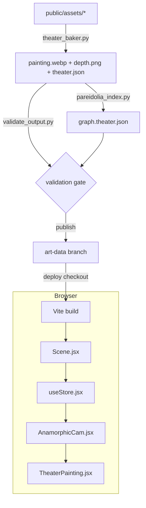
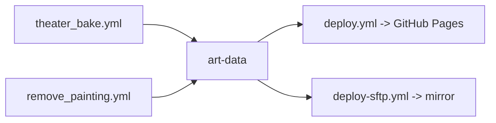

# Architecture Overview

The site is a hybrid static/dynamic build. Paintings are baked offline into a small paper-theater data model, published to the orphan `art-data` branch, then consumed by the React/Three.js frontend at build/runtime.

For the creative brief, see `../AGENTS.md`. For rendering details, see `SHADERS.md`. For day-to-day operation, see `WORKFLOW.md`.

## Data flow

```mermaid
graph TD
    A[public/assets/*] -->|theater_baker.py| B[painting.webp + depth.png + theater.json]
    B -->|pareidolia_index.py| C[graph.theater.json]
    B -->|validate_output.py| D{validation gate}
    C --> D
    D -->|publish| E[art-data branch]
    E -->|deploy checkout| F[Vite build]

    subgraph Browser
      F --> G[Scene.jsx]
      G --> H[useStore.jsx]
      H --> I[AnamorphicCam.jsx]
      I --> J[TheaterPainting.jsx]
    end
```

## Paper-theater model

Each baked painting has:

- `{id}.painting.webp` — cropped gallery texture
- `{id}.depth.png` — pixel-aligned 16-bit depth map
- `{id}.theater.json` — dimensions, depth provenance, and merged depth-band metadata

`TheaterPainting.jsx` turns those assets into a stack of opaque, depth-tested cutout planes. The planes reassemble at the null viewpoint and separate under camera motion to create the diorama effect.

There is no live shard cloud, point cloud, SAM segmentation renderer, or synthesized stroke library in the shipped frontend.

## Pareidolia hinge graph

`scripts/pareidolia_index.py` compares baked paintings and records plausible shared visual patches as sparse directed edges in `graph.theater.json`.

At runtime, `useStore.jsx` walks that graph and places consecutive paintings so their matched patches occupy the same world-space point. The camera then dives through that hinge while `TheaterPainting.jsx` reveals the incoming painting around it.

## Camera and state

`AnamorphicCam.jsx` maps scroll position onto the current segment and samples a cached `CatmullRomCurve3` for camera motion. It also owns keyboard navigation and reduced-motion behavior.

`src/store/useStore.jsx` owns:

- the loaded graph
- the visited segment sequence
- world-space placement
- `currentSegmentIndex`
- `transitionProgress`
- resize-driven placement recomputation

Frame state is updated atomically so consumers never observe a new segment index with stale transition progress.

## Rendering

The renderer uses hard fragment discards rather than alpha-blended band edges. That is intentional: an earlier antialiasing attempt produced persistent contour artifacts because the flats are opaque and depth-tested.

`Scene.jsx` also owns the full-screen background sweep that transitions between dark and light gallery ground as required by the current painting.

## Frontend routes

- `/` — gallery
- `/admin` — mobile-first GitHub-backed content manager
- `/projects` — dynamic list of other GitHub Pages projects

`/admin` and `/projects` are lazy-loaded so normal gallery visitors do not pay their bundle cost.

## CI/CD

The live art pipeline is singular now:

```mermaid
graph LR
    TB[theater_bake.yml] --> AD[art-data]
    RP[remove_painting.yml] --> AD
    AD --> DP[deploy.yml -> GitHub Pages]
    AD --> SF[deploy-sftp.yml -> mirror]
```

- `theater_bake.yml` is a secretless proxy managed by `HereLiesAz/workflows`. It dispatches the central implementation that runs the bake, hinge index, validation, and publication.
- `remove_painting.yml` removes retired artwork from the data branch and causes a redeploy.
- `deploy.yml` is repository-bound and deploys GitHub Pages after checking out `art-data` into `public/data`.
- `deploy-sftp.yml` is centrally managed and mirrors the built site to the external host.
- `backup.yml` is an unrelated repository backup utility.

The retired `process_art.yml` and `bootstrap.yml` pipelines were removed in September 2026. Their old shard-cloud/SAM design survives only in `docs/archive/`.

## Script inventory

### Live

| Script/data | Called by | Role |
|---|---|---|
| `theater_baker.py` | Theater Bake | Bake painting, depth, and band metadata |
| `pareidolia_index.py` | Theater Bake | Build the hinge graph |
| `validate_output.py` | Theater Bake | Validate publishable output |
| `crops.json` | `theater_baker.py` | Hand-authored crop boxes |
| `requirements.txt` | Python bake jobs | Pipeline dependencies |
| `verify-assets.cjs` | deploy build | Repair the legacy flat fallback graph |
| `deduplicate.py` | manual only | Destructive perceptual duplicate cleanup |

### Removed legacy implementation

The following abandoned scripts were deleted from the executable tree in September 2026: `grinder.py`, `bootstrap.py`, `indexer.py`, `pareidolia.py`, `curator.py`, `jules.py`, `3d_deconstructor.py`, `prepare.py`, `repair_and_index.py`, and `bake-shards.js`.

Historical design documents remain under `docs/archive/`.
